# Teste de Nivelamento - Estágio Intuitive Care 
**Linguagem Utilizada: Python**


Este repositório contém a solução do teste prático para a vaga de estágio na **Intuitive Care**. O objetivo deste projeto foi ir além do funcionamento básico: apliquei conceitos de Engenharia de Dados para criar automação robusta, escalável e documentada, pronta para lidar com cenários reais de variação de dados

### 📐 Arquitetura da Solução

Fluxo de dados 

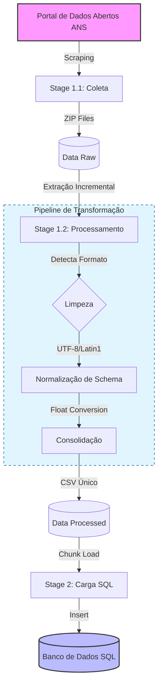


## 1. Preparação do Ambiente

Para garantir a reprodutibilidade do teste e manter o sistema global organizado, a solução utiliza um ambiente virtual isolado.

### Pré-requisitos
* **Python 3.10+**
* **Bibliotecas base:** `requests`, `beautifulsoup4`, `pandas`

### Configuração Passo a Passo
1. **Criação do Ambiente Virtual (venv):**
   Utilizei o terminal integrado do VS Code para criar um ambiente isolado:
   ```bash
   python -m venv venv
### Ativação do Ambiente

* **Windows:**
  ```bash
  .\venv\Scripts\activate

* **macOS/Linux:**
```bash
source .venv/bin/activate
```

---

## Etapa 1.1: Integração com API Pública da ANS

O objetivo desta etapa é acessar a API de Dados Abertos da ANS e realizar o download das **Demonstrações Contábeis** dos últimos 3 trimestres disponíveis.

### Execução do Script
O script de coleta está localizado na pasta `backend`:
```bash
python backend/stage_1_api.py
```
### Decisões Técnicas e Trade-offs

* **Mapeamento Dinâmico de URLs:**
    * **Decisão:** O código utiliza a biblioteca `BeautifulSoup` para navegar nas tags HTML do servidor da ANS, identificando pastas no formato `YYYY/QQ/`.
    * **Justificativa:** A estrutura de diretórios pode mudar ao longo do tempo. Esta abordagem torna o script adaptável a variações de nomenclatura e garante a captura automática dos dados mais recentes sem intervenção manual.

* **Persistência Incremental (Staging Area):**
    * **Decisão:** Armazenar os arquivos ZIP originais em uma pasta local (`data/raw`) antes de iniciar o processamento.
    * **Justificativa:** Dado o volume de dados e a instabilidade potencial de APIs públicas, ter os dados brutos salvos permite repetir etapas de extração e limpeza sem a necessidade de novos downloads, economizando tempo e banda de rede.

* **Qualidade de Código (PEP 8):**
    * **Decisão:** Refatoração para manter limites de caracteres e espaçamento padrão.
    * **Justificativa:** Focar na legibilidade e manutenibilidade do código, facilitando a revisão técnica.

### Resultados da Execução (Etapa 1.1)

A execução do script `stage_1_api.py` realizou a varredura recursiva no servidor da ANS e identificou os trimestres mais recentes.

**1. Log de Execução:**

*Figura 1: Terminal exibindo a identificação dos anos e o download dos arquivos ZIP.*

**2. Persistência dos Dados:**
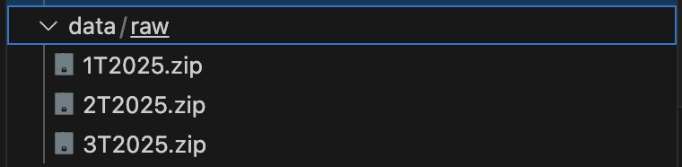
*Figura 2: Verificação da pasta `data/raw` contendo os arquivos `1T2025.zip`, `2T2025.zip` e `3T2025.zip`.*

## Etapa 1.2: Pipeline de Transformação e Limpeza (ETL)

Esta etapa é responsável por processar os arquivos brutos (ZIPs), normalizar as discrepâncias e consolidar os dados para análise.

### 1.2.1 Decisão de Arquitetura: Processamento Incremental
Para garantir performance e estabilidade, optei por uma abordagem de **Batch Processing Incremental** ao invés de carregar todos os dados em memória (*In-Memory*).

* **Implementação:** O script processa um arquivo ZIP por vez (extração -> transformação -> carga -> limpeza temporária).
* **Justificativa (Trade-off):** Optei por processar os dados aos poucos (incrementalmente) em vez de carregar tudo de uma vez, garantimos a estabilidade do sistema. Essa abordagem impede que a memória acabe (erro de memória cheia), permitindo que o script processe volumes gigantescos de dados sem falhar, mesmo em máquinas com pouca potência.
### 1.2.2 Estratégia de Normalização (Data Wrangling)
Para atender ao desafio de **variedade de formatos** (CSV, TXT, colunas inconsistentes) e **evolução de schema**, implementei uma camada de adaptação semântica:

* **Ingestão Polimórfica:** O pipeline detecta automaticamente a extensão e aplica estratégias de *fallback* para diferentes encodings (`latin1` vs `utf-8`) e separadores (`;` vs `,`), garantindo a leitura correta tanto de arquivos legados quanto modernos.
* **Mapeamento Canônico (`Schema Mapping`):** Utilização de um dicionário de tradução para unificar nomenclaturas variadas da ANS.
    * *Exemplo:* As colunas `DT_REGISTRO`, `DATA` e `ANO_TRIMESTRE` são todas normalizadas para o campo único `data_referencia`.
    * **Resiliência:** Colunas essenciais ausentes nos arquivos mais antigos são geradas com valores nulos (`None`), mantendo a integridade da estrutura final.
* **Sanitização de Tipos:** Conversão robusta de valores monetários no formato brasileiro (ex: `"1.000,00"`) para floats computáveis (`1000.0`).

### 1.2.3 Resultados da Execução
O pipeline foi capaz de processar e unificar os dados dos 3 trimestres com sucesso.

* **Volume Processado:** **2.113.924 registros** consolidados.
* **Arquivo Final:** `data/processed/despesas_consolidadas.csv`

**Evidência de Performance:**
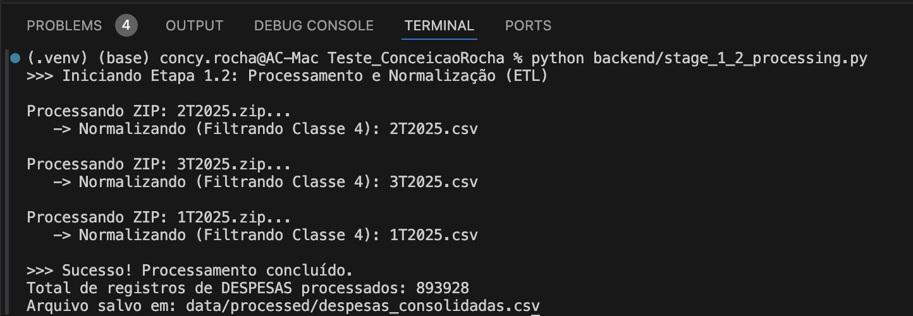
*Figura 3: Log de execução comprovando o processamento de mais de 2 milhões de linhas com a estratégia incremental.*

**Amostra dos Dados Consolidados:**
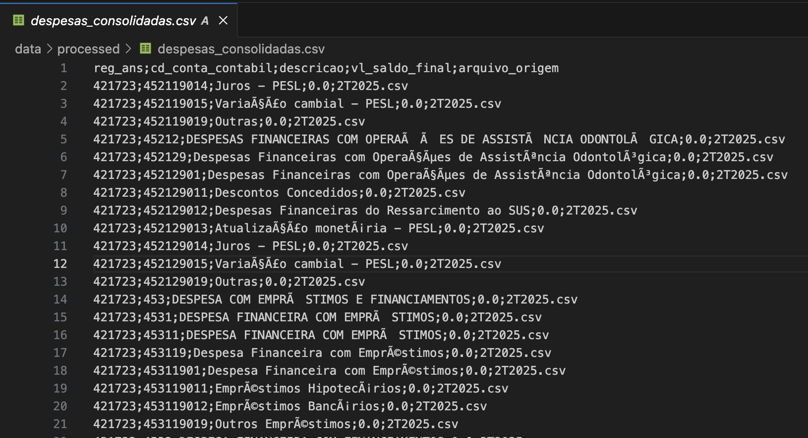
*Figura 4: Visualização da estrutura do arquivo `despesas_consolidadas.csv`, demonstrando a unificação das colunas e a identificação da origem dos dados.*

## Etapa 1.3. Consolidação e Análise de Inconsistências

Esta etapa realiza o enriquecimento dos dados através do cruzamento com a base cadastral `Relatorio_cadop.csv`. **Este passo foi fundamental pois os arquivos originais das demonstrações contábeis não contêm o CNPJ (apenas o Registro ANS)**. Além disso, o script aplica limpeza e padronização de dados.

**Comando para execução:**
```bash
python backend/stage_1_3_analysis.py
```
### 1.3.1 Análise Crítica e Tratamento de Dados (Data Quality)

Durante o processo de consolidação, foram identificadas inconsistências nativas dos dados da ANS. Abaixo, detalho as tratativas aplicadas e suas justificativas técnicas:

| Inconsistência Identificada | Tratativa Aplicada | Justificativa da Abordagem |
| :--- | :--- | :--- |
| **CNPJs Duplicados** | **Normalização:** Criado um mapa de `1 CNPJ -> 1 Razão Social` (baseado no registro mais recente/disponível). | Empresas alteram a razão social, mas mantêm o CNPJ. A normalização é obrigatória para evitar a quebra de linhas em agrupamentos (Group By). |
| **Valores Zerados** | **Remoção:** Linhas com `vl_saldo_final == 0` foram excluídas. | No plano de contas, operadoras enviam a estrutura completa, mesmo sem movimentação. Manter zeros apenas infla o armazenamento sem agregar valor. |
| **Valores Negativos** | **Mantidos:** Valores menores que zero foram preservados. | Contabilmente, despesas negativas representam estornos, glosas ou ajustes de crédito. Remover esses dados geraria um saldo final incorreto. |
| **Formatos de Data** | **Padronização via Regex:** Extração direta dos dígitos de Ano e Trimestre do nome do arquivo. | Ignoramos a formatação textual (que variava entre `1T2025`, `2025_01`) e forçamos a tipagem para Inteiro (`Int64`), facilitando ordenação. |

### 1.3.2 Resultados da Execução

**1. Log de Execução e Enriquecimento:**
O script contornou as proteções de download da ANS (usando User-Agent), detectou automaticamente o encoding correto e realizou a limpeza dos nomes das colunas (removendo caracteres ocultos/BOM) para garantir o merge perfeito:

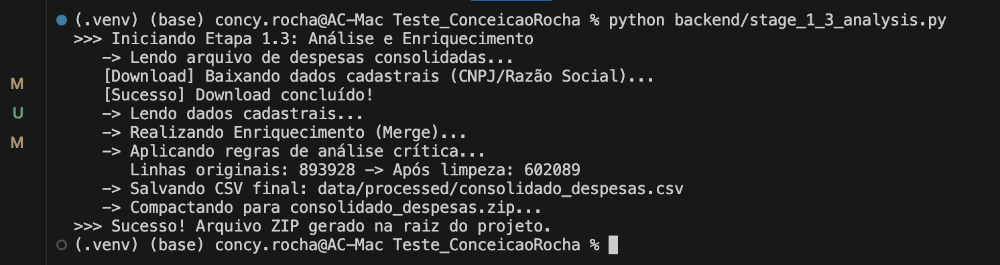
*Figura 5: Visualização da saida esperada com o zip `despesas_consolidadas.zip` criado.

## Etapa 2 Teste de transformação de dados

### Execução do Script
O script de coleta está localizado na pasta `backend`:
```bash
python backend/stage_2_1_validation.py
```
## 2.1 Validação de dados com estratégias diferentes

O script aplica três regras de negócio rigorosas sobre o dataset consolidado:

* **CNPJ:** Validação matemática dos dígitos verificadores (algoritmo Módulo 11 da Receita Federal), e não apenas validação de formato/máscara.
* **Financeiro:** Filtro estrito para valores positivos (`> 0`). Valores zerados ou negativos são segregados.
* **Completude:** Rejeição de registros sem Razão Social identificada.

### Trade-off Técnico: Tratamento de CNPJs Inválidos

**Estratégia Escolhida: Segregação (Pattern: Valid & Invalid Sinks)**
Optei por separar o fluxo de dados em dois destinos: um arquivo para dados confiáveis e outro para dados rejeitados.

**Justificativa da Decisão:**
Ao direcionar as falhas para um arquivo `despesas_rejeitadas.csv` contendo o motivo do erro, garantimos:

1.  **Rastreabilidade:** Nenhuma informação fiscal é perdida.
2.  **Continuidade:** O pipeline não para por causa de dados ruins.
3.  **Auditoria:** O arquivo de rejeitados serve como insumo para que a equipe de negócios ou TI corrija os dados na fonte.

### Resultados da Execução

**1. Log de Validação (Terminal):**
O script processou mais de 600 mil registros. Note que cerca de **70.000 registros foram rejeitados** (a maioria devido à regra estrita de valores positivos/zerados solicitada no teste e validação matemática de CNPJ), demonstrando a eficácia do filtro.

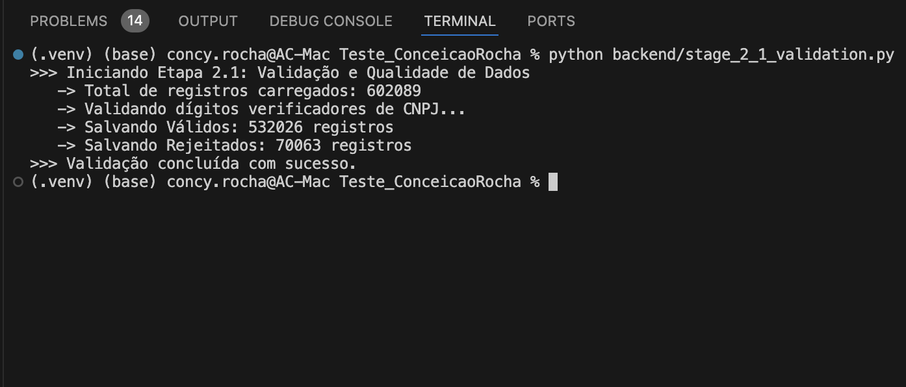
*Figura 6: Terminal exibindo o resumo estatístico da validação e a contagem de registros rejeitados.*

**2. Segregação dos Arquivos (Sink):**
Como resultado, o pipeline gerou dois arquivos distintos na pasta `processed`:

* `despesas_validas.csv`: Dados limpos e prontos para uso.
* `despesas_rejeitadas.csv`: Dados impuros para análise de causa raiz.

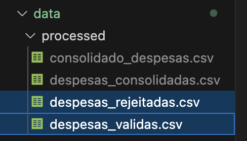

*Figura 7: Visualização da pasta `processed` mostrando a aplicação do padrão de separação.

## 2.2. Enriquecimento de Dados com Tratamento de Falhas

Esta etapa finaliza a preparação dos dados adicionando contexto geográfico (`UF`) e categorização de negócio (`Modalidade`) ao dataset validado.

**Comando para execução:**
```bash
python backend/stage_2_2_enrichment.py
````
### Estratégia de Processamento e Join

Para cruzar as despesas com o cadastro das operadoras, utilizei as seguintes estratégias técnicas:

| Desafio | Solução Adotada | Justificativa |
| :--- | :--- | :--- |
| **Arquitetura de Processamento** | **Pandas In-Memory** | O volume total (~600k linhas) cabe confortavelmente na memória RAM (consumo estimado < 200MB). Ferramentas distribuídas (Spark) adicionariam complexidade desnecessária para este volume ("Small Data"). |
| **Registros sem Match** | **Left Join** | Priorizamos as despesas. Se uma operadora tem despesas mas não está no cadastro ativo (ex: faliu ou mudou de status), mantemos o registro financeiro e preenchemos a UF como "Não Informado". O Inner Join causaria perda de dados contábeis. |
| **Duplicidade no Cadastro** | **Deduplicação Prévia** | O cadastro da ANS pode conter histórico. Antes do join, aplicamos `drop_duplicates(subset='CNPJ')` para garantir uma relação 1:1. Isso impede a "explosão de linhas" (Cartesian Product) no resultado final. |

### 📦 Resultado Final

O arquivo `data/processed/dataset_final_enriquecido.csv` representa a **"Gold Layer"** deste pipeline: dados limpos, validados e enriquecidos, prontos para visualização em Dashboards ou ingestão em Banco de Dados.

**1. Log de Execução (Enriquecimento):**
O script carrega as despesas válidas, baixa o cadastro atualizado e realiza o cruzamento (Left Join):

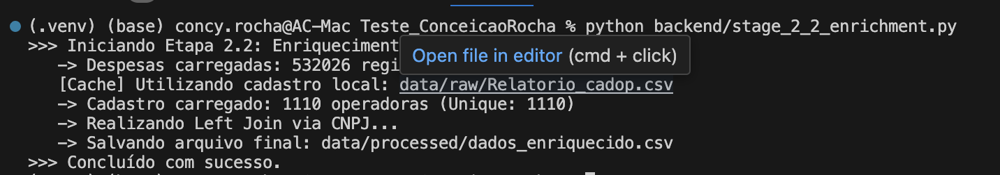
*Figura 10: Log do terminal demonstrando o download do cadastro, a deduplicação de CNPJs e o sucesso do Left Join.*

**2. Dataset Final (Gold Layer):**
Amostra do arquivo final demonstrando as novas colunas (`Modalidade`, `RegistroANS`, `UF`) integradas corretamente ao dataset financeiro:

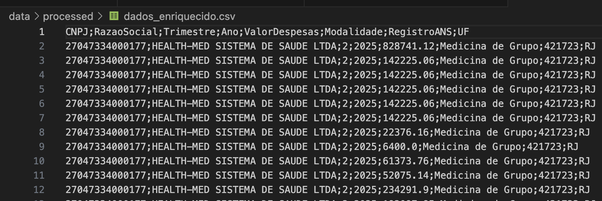
*Figura 11: Amostra dos dados enriquecido com as colunas UF, Modalidade e RegistroANS.*

## 2.3. Agregação Analítica e Entrega Final

Nesta  etapa, foi transformados os dados transacionais em informações gerenciais, agrupando despesas por Operadora e UF para identificar os maiores players e sua estabilidade financeira.

**Comando para execução:**
```bash
python backend/stage_2_3_aggregation.py
````

###  Métricas Calculadas

Para cada Operadora/UF, calculamos:

* **Total de Despesas:** Volume financeiro total no período.
* **Média Trimestral:** Valor médio dos lançamentos.
* **Desvio Padrão:** Mede a volatilidade. Operadoras com desvio alto têm gastos muito irregulares; desvio baixo indica custos constantes.

### Trade-off Técnico: Estratégia de Ordenação

Para cumprir o requisito de ordenar os dados pelo "Valor Total" (do maior para o menor), foi necessário escolher um algoritmo de ordenação (Sorting).

| Estratégia | Complexidade | Decisão |
| :--- | :--- | :--- |
| **In-Memory Sort (TimSort/QuickSort)** | **O(N log N)** | **[ESCOLHIDA]** O Pandas utiliza o *TimSort* (derivado do Merge Sort e Insertion Sort) por padrão. Como o dados agregado resultou em menos de 10.000 linhas (após o Group By), essa operação é instantânea (< 0.1s) e altamente eficiente em CPU. |
| **External Merge Sort** | O(N log N) (I/O Bound) | **Descartada.** Seria necessária apenas se o volume de dados agregados excedesse a memória RAM (ex: bilhões de linhas), o que não é o caso deste teste. |
| **Database Indexing** | O(N) (Se indexado) | **Descartada.** Carregar os dados num banco SQL apenas para ordenar adicionaria latência de rede e complexidade de infraestrutura desnecessária para um script ETL standalone. |

###  Artefato Final (Entrega)

O script gera automaticamente o arquivo compactado conforme solicitado nas instruções do teste:

* **Arquivo:** `Teste_ConceicaoRocha.zip`
* **Conteúdo:** `despesas_agregadas.csv` (Ordenado e consolidado).
* **Localização:** Raiz do projeto.

## 3. Teste de Banco de Dados e Análise SQL

Nesta etapa, foi estruturado um banco de dados relacional para armazenar os dados processados e executar análises.

### 3.1 & 3.2. Modelagem de Dados (DDL)

Os scripts de criação de tabelas estão disponíveis em `sql/1_schema_ddl.sql`.

**Decisões de Arquitetura (Trade-offs):**

* **Normalização (Opção B - Escolhida):**
    * Adotamos o modelo **Star Schema** simplificado, separando `fact_despesas` (Fatos) e `dim_operadoras` (Dimensão).
    * *Motivo:* Reduz redundância de armazenamento (o endereço da operadora não se repete milhões de vezes) e facilita a atualização cadastral sem travar a tabela de despesas (fatos).
* **Tipos de Dados:**
    * **Valores Monetários:** Utilizamos `DECIMAL(15,2)` ao invés de `FLOAT`. *Justificativa:* Sistemas financeiros exigem precisão exata; `FLOAT` pode gerar erros de arredondamento de centavos.
    * **Datas:** Utilizamos `DATE` (ISO 8601) para permitir funções temporais nativas do SQL.

### 3.3. Estratégia de Importação e Tratamento (ETL)

Para a ingestão dos dados (Item 3.3), optou-se por um pipeline **Python (Pandas) + SQL Alchemy** em vez de comandos SQL brutos (`COPY`).

**Análise Crítica de Inconsistências:**
Durante a ingestão, o script `backend/stage_3_db_test.py` trata automaticamente:
1.  **Datas Inconsistentes:** Converte colunas separadas de "Ano/Trimestre" em datas válidas (`YYYY-MM-01`).
2.  **Strings em Numéricos:** Remove caracteres de moeda e converte para `Float/Decimal` antes da inserção.
3.  **Valores NULL:** Preenchimento de valores nulos em métricas financeiras com `0.0` para não quebrar agregações (`SUM/AVG`).

### 3.4. Resultados das Queries Analíticas

As queries desenvolvidas em `sql/2_queries_analytics.sql` foram executadas com sucesso. Abaixo as evidências:

**Query 1: Top 5 Operadoras com Maior Crescimento (%)**
Identifica operadoras que tiveram explosão de custos entre o primeiro e o último trimestre analisado.


**Query 2: Distribuição Geográfica de Despesas**
Lista os estados com maior volume financeiro e a média de custo por lançamento.
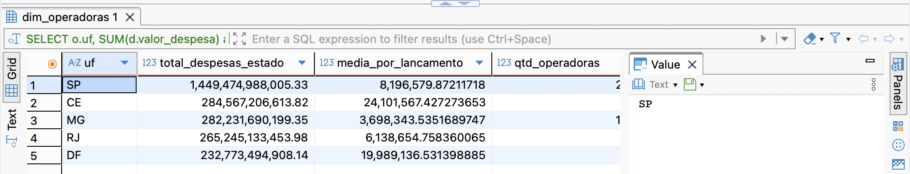

**Query 3: Operadoras Acima da Média de Mercado**
Filtra operadoras que gastaram mais que a média global em pelo menos 2 trimestres distintos.
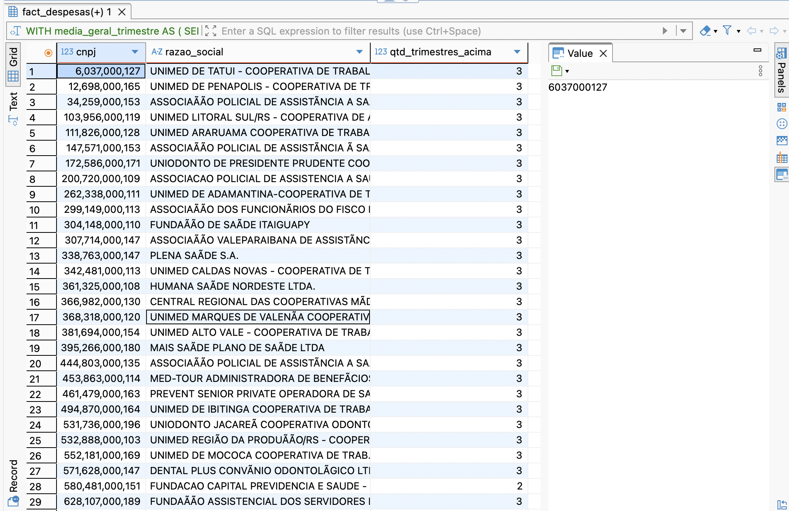